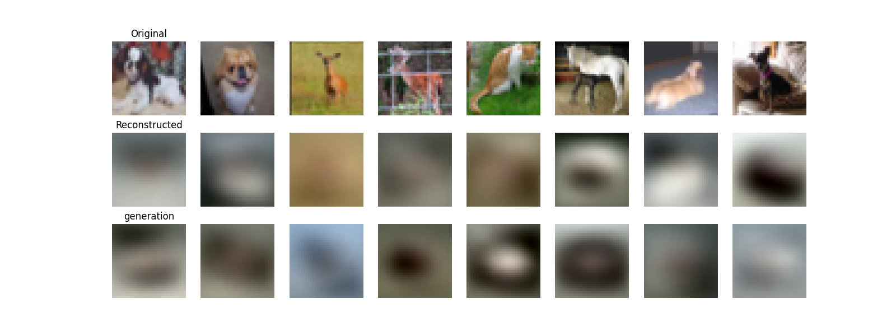

# variational-autoencoder

### Introduction

Implementation for VAE(variational-autoencoder), the results are as follows:




I find it's hard to train a VAE model on cifa10 dataset, the results are not good enough. I think the reason is that the model is too simple, and the dataset is too complex. I will try to improve the model in the future.

### Usage

```shell
pythpn train.py --dataset MNIST --path ./data
```

or

```shell
pythpn train.py --dataset CIFA10 --path ./data
```

You can choose the path to save the dataset. After that, you can run the following command to test the model:

```shell
python test.py --dataset MNIST --path ./data
```